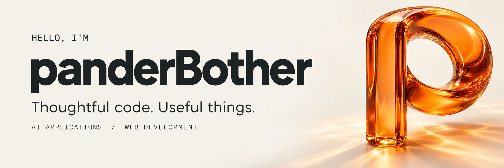
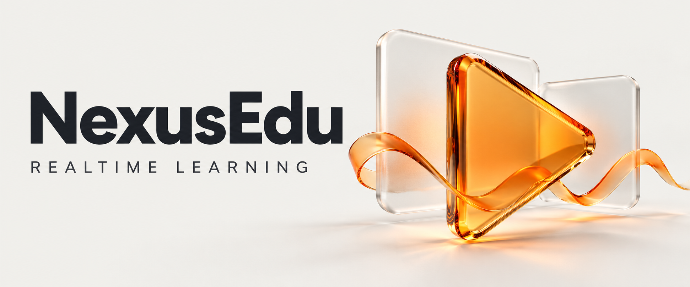
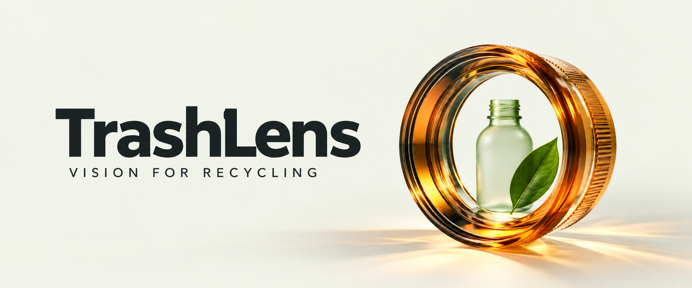

  

  <a href="https://blog.csdn.net/2301_80163888"><b>CSDN 博客 ↗</b></a>
  &nbsp;&nbsp; / &nbsp;&nbsp;
  <a href="mailto:dyzbear88@gmail.com">dyzbear88@gmail.com</a>
  &nbsp;&nbsp; / &nbsp;&nbsp;
  15603776449

 

### 把想法写成代码，把代码做成体验。

你好，我是 **panderBother**。围绕 **Web 开发与 AI 应用**做项目，也在 [CSDN](https://blog.csdn.net/2301_80163888) 记录学习与实践。

从 Vue / React 界面，到实时音视频、RAG 知识库和图像识别，我喜欢沿着一个具体问题，把前后端串起来，再把体验打磨好。

 

## Selected work · 精选项目

<table>
  <tr>
    <td width="50%" valign="top">
      

      AI · KNOWLEDGE
      <h3><a href="https://github.com/panderBother/KnowMind">KnowMind ↗</a></h3>
      
<b>让自己的知识，成为可对话的资料库。</b>

      
私有知识库平台，串联文档解析、混合检索、流式问答与报告生成，支持 MCP 工具集成。

      
<code>React</code> <code>FastAPI</code> <code>RAG</code> <code>MCP</code>

    </td>
    <td width="50%" valign="top">
      

      WEB · REALTIME
      <h3><a href="https://github.com/panderBother/NexusEdu">NexusEdu ↗</a></h3>
      
<b>让直播与弹幕，流畅地发生。</b>

      
在线教育与直播项目，探索实时音视频、Canvas 弹幕、AI 人像防遮挡和 Worker 离屏渲染。

      
<code>Vue 3</code> <code>TypeScript</code> <code>WebRTC</code>

    </td>
  </tr>
  <tr>
    <td width="50%" valign="top">
      

      AI · COMPUTER VISION
      <h3><a href="https://github.com/panderBother/TrashLens">TrashLens ↗</a></h3>
      
<b>用图像识别，理解垃圾分类。</b>

      
基于 YOLOv8 的垃圾分类检测应用，将模型推理接入 Web 界面，连接识别能力与使用场景。

      
<code>Python</code> <code>YOLOv8</code> <code>Flask</code> <code>Vue 3</code>

    </td>
    <td width="50%" valign="top">
      

      WEB · COMMERCE
      <h3><a href="https://github.com/panderBother/vue-pander-rabbit">小兔鲜电商 ↗</a></h3>
      
<b>在业务实践里，打磨前端基础。</b>

      
基于 Vue 3 的小型电商项目，实践组件开发、Pinia 状态管理与 Vue Router 路由组织。

      
<code>Vue 3</code> <code>Pinia</code> <code>Vue Router</code>

    </td>
  </tr>
</table>

 

## Toolbox · 常用技术

  
  
  
  
  
  
  

**前端与交互** &nbsp; Vue 3 / React / TypeScript / Canvas / Web Worker  
**应用与服务** &nbsp; Python / FastAPI / Flask / MySQL / Docker  
**探索方向** &nbsp; RAG / MCP / WebRTC / 计算机视觉

 

## Field notes · 写下实践

把遇到的问题、试过的方案和学到的东西，留在文字里。

- [带你深入了解 Web Worker](https://blog.csdn.net/2301_80163888/article/details/153106662) — 从后台线程到前端性能优化。
- [低延迟直播系统的学习与收获](https://blog.csdn.net/2301_80163888/article/details/155156607) — 记录协议选型与直播实践。

**[阅读更多 · CSDN 博客 ↗](https://blog.csdn.net/2301_80163888)**

 

---

<b>一起交流技术，也一起把想法做出来。</b>

  <a href="https://blog.csdn.net/2301_80163888">CSDN 博客</a>
  &nbsp; | &nbsp;
  15603776449
  &nbsp; | &nbsp;
  <a href="mailto:dyzbear88@gmail.com">dyzbear88@gmail.com</a>

Thoughtful code. Useful things.

